# CodingAssignment2
Requirements
This application can be built on any framework which you are comfortable with and feel is best
suited for this.
1. You would need to create both frontend & backend APIs for this application.
2. Create a basic user registration and authentication system.
3. Create APIs using which a user can define their available slots for a particular day. Assume
that each slot is a fixed hourly slot. For example, 12:00-13:00, 13:00-14:00, etc.
4. Create frontend & APIs using which a user can book an available slot.
5. Show an error page when an unauthenticated user is trying to access the APIs.

## Basic user registration and authentication system 
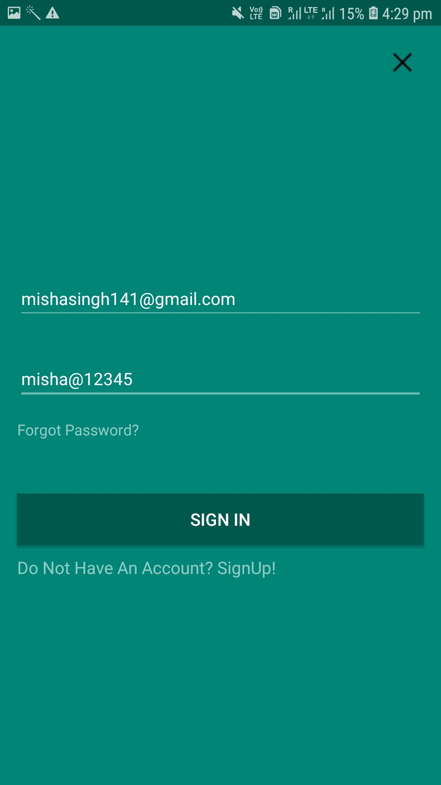  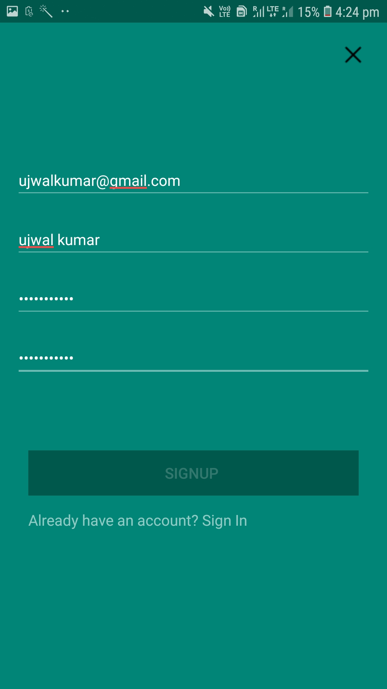  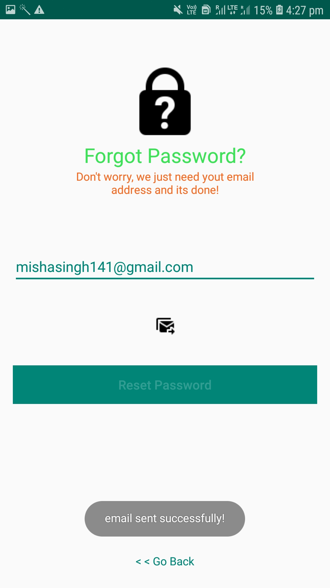

### User Data Stored In Cloud Firestore
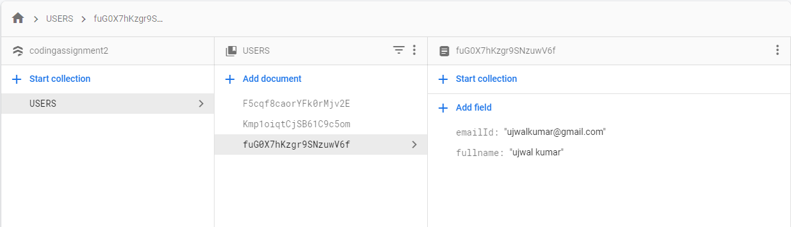

## MainActivity For Defining and Deleting Slots
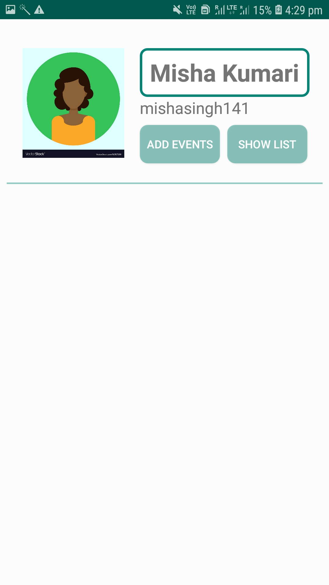 

### Adding Slots
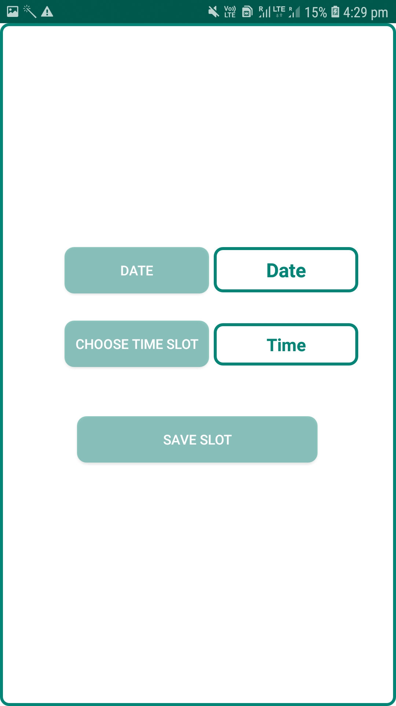  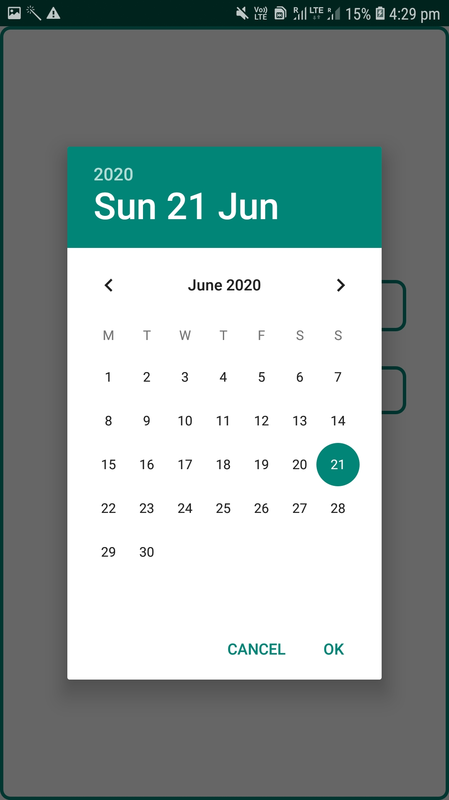
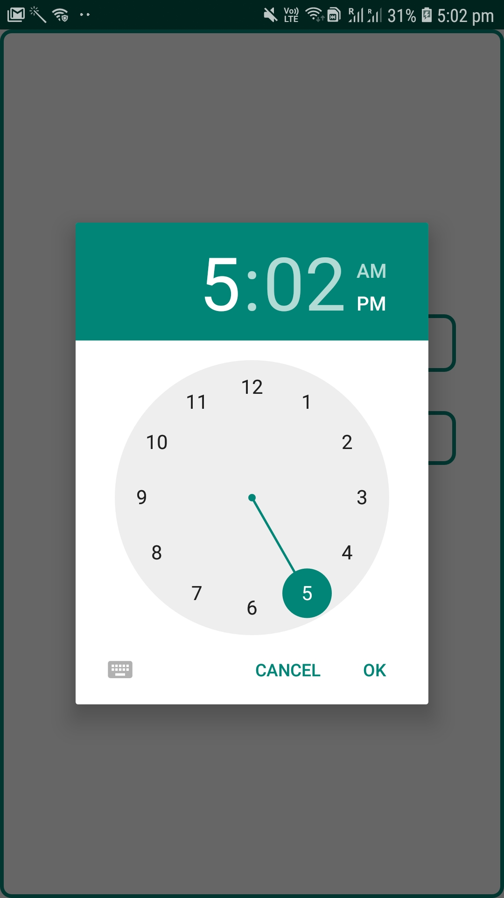  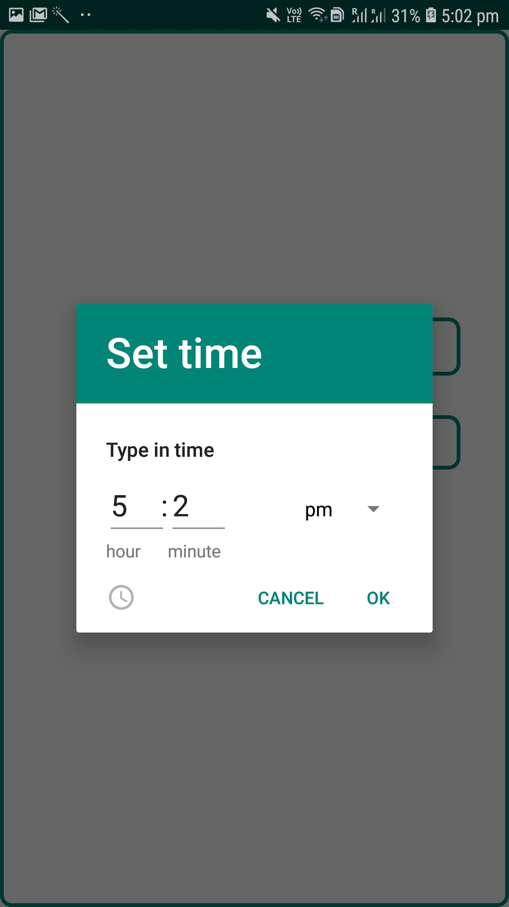  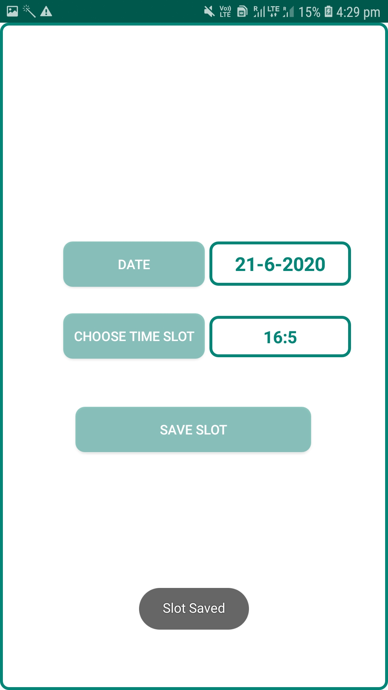

### Slot Information Stored in Firebase RealTime Database
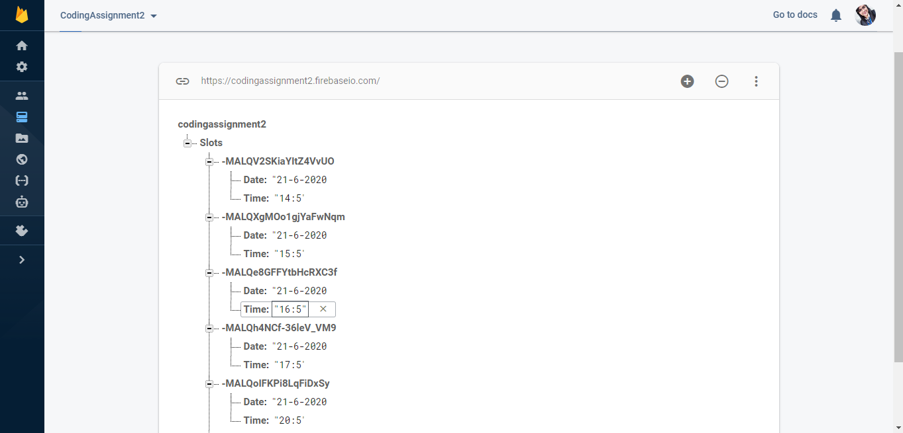

### View Slot details and Perform Delete Operation
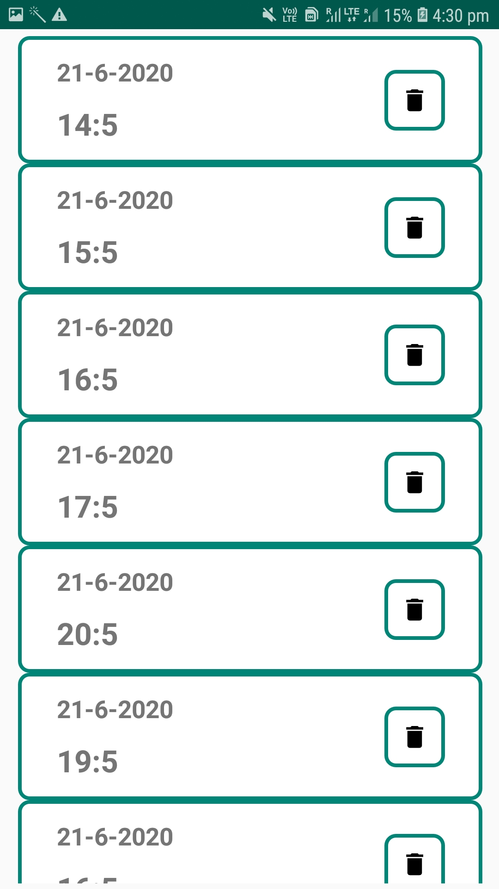  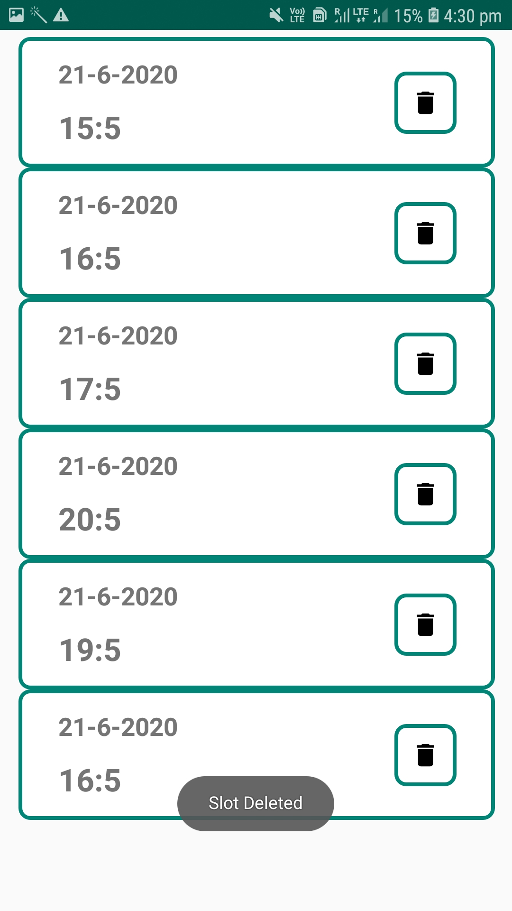

## Unauthenticated Users Denied To Access Difining Slots And Deleting Slots

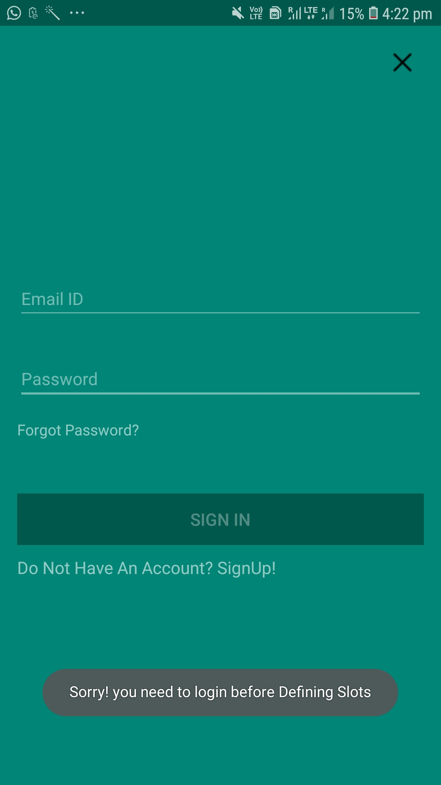
